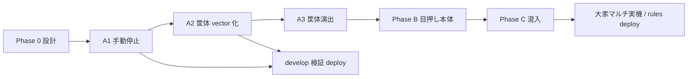

# ver1.0.4（作業中 — 引き継ぎ正本）

- **ブランチ:** `ver1.0.4`
- **切り出し元:** `develop`（`155e37d` 時点）
- **リモート:** `origin/ver1.0.4`（作成後 push）
- **Git tip:** `git log -1 --oneline` on `ver1.0.4`
- **記録更新:** 2026-07-29

> **新しいチャットで作業再開するとき:** このファイル → [develop.md](develop.md) → [ver1.0.3.md](ver1.0.3.md)（完了分の詳細）→ [game-rules.md](../references/game-rules.md)

---

## ブランチ方針

```
ver1.0.4（作業） → develop（検証） → main（本番）
```

`ver1.0.4` は **develop から切った作業ブランチ**。完了した変更は `develop` にマージして検証 deploy する。

---

## 引き継ぎ元（ver1.0.3 / develop）

`ver1.0.3` で完了済みの主な内容（詳細は [ver1.0.3.md](ver1.0.3.md)）:

| 項目 | 状態 |
|------|------|
| 拡張性 Phase 1〜5 | **完了** |
| 大家（landlord） | **実装済** |
| 家賃タイミング | ターン開始・1日1回 |
| 8日目アイテム Phase 1 | **実装済** |
| タクシーログ二重 | **修正済**（`logsAlreadyWritten`） |
| テスト | `npm run test:run` → **237 passed** |

---

## 現在の状態（2026-07-29 開始時）

| 項目 | 状態 |
|------|------|
| コード差分 | `develop` と同一（作業開始直後） |
| マルチ実機 | **未** |
| Firestore rules deploy | **未** |
| 検証 Hosting deploy | **未** |
| 本番 `deploy:prod` | **明示依頼まで禁止** |

---

## 未デプロイ / 未確認（ver1.0.3 から継続）

- [ ] Firestore rules deploy（stale cutin 等）
- [ ] Hosting 検証 `npm run deploy`
- [ ] **大家マルチ実機**（2人以上・家賃・日跨ぎ・ゴースト）
- [ ] Hosting 本番 `deploy:prod` — 明示依頼まで出さない

---

## 既知・回収予定

| 優先 | 内容 |
|------|------|
| 中 | SP: スロット HUD 折りたたみ / サイドバー → ボトムタブ |
| 低 | `.agents/` を `.gitignore` に |

---

## ver1.0.4 の主題 — スロット目押し（段階実装）

**ゴール:** 基本は今まで通り（結果はスピン開始時に確定）。**チャンスタイミングがたまに発生**し、そのときだけ**完全な目押し**（停止位置が配当に影響）。それ以外は従来どおり。

**正本:** 本節（作業ブランチ）＋実装時は [day8-guide.md](../references/day8-guide.md) のスロット節も同期。

### 現状アーキテクチャ（2026-07-30 更新）

```
掛け金確定 → spinSlot() で tier + reels 確定（gameLogic.js）
           → Firestore: slotPhase=spinning, targetResult, slotVisualReels
           → SlotMachine: 手動 STOP で左→中→右停止（操作者・Phase A）
           → SlotSpinBroadcastOverlay: 従来タイマーで観戦ミラー
```

**リール絵柄は既に Canvas**（`SlotReelCanvasView`）。**筐体だけ PNG + CSS マスク + % 座標**がボトルネック（STOP/SPIN の透明ヒット領域、マスクずれ、演出の足しにくさ）。

**方針（確定 2026-07-30）:** **8日目スロットは筐体を描画（DOM/SVG）に移行**。デイリースロット練習は **PNG 筐体のまま**。

```
SlotCabinetShell（新規・共通シェル）
  ├─ variant="image"   → DailySlotTrainingModal（現状維持）
  └─ variant="vector"  → SlotMachine + SlotSpinBroadcastOverlay（8日目）

SlotReelCanvasView     → 両方で共用（変更不要）
```

目押し実装の**最大リスク**は UI ではなく **「停止タイミングの権威（誰がいつ止めたか）」とマルチ同期**（Phase B 以降）。

---

### 推奨フェーズ（目押し + 筐体描画）

| Phase | 内容 | 配当への影響 | 規模感 | 状態 |
|-------|------|--------------|--------|------|
| **0** | 設計・定数・テスト骨格 | なし | 小〜中 | **完了** |
| **A1** | 手動停止（STOP×3・押すまで止まらない） | なし | 中 | **実装済・要コミット** |
| **A2** | **8日目筐体ベクトル化**（`SlotCabinetShell`） | なし | 中 | 次 |
| **A3** | 筐体演出フック（リーチランプ・反動・オーラ） | なし | 小〜中 | A2 後 |
| **B** | チャンス時の完全目押し | **あり** | **大** | 未着手 |
| **C** | チャンス混入（確率・条件） | チャンス時のみ B | 中 | 未着手 |

**旧 Phase A（1+2 統合）** → **A1（停止ロジック）+ A2（筐体 UI）** に分割。A2 を A1 の直後にやると STOP 配置の手戻りが少ない。

---

### Phase 0 — 設計・定数（完了）

| 項目 | 内容 |
|------|------|
| **ガセリーチ発生** | ハズレの **18%**（`nearMissReachChance`） |
| **目押し付与** | ガセリーチ成立スピンの **70%**（`gaseReachSkillStopChance`） |
| **対象演出** | `tier=miss` かつ 1・2リール同絵柄・3リール目だけ外れ |
| **体感（目押し）** | 約 **10.7%/スピン**、1席3スピンで約 **29%** |

- [x] `gameBalance.js`, `lib/slotReelStop.js`, 単体テスト
- [ ] Firestore `slotSkillStopActive` / `slotSkillStopMode`（B 着手時）
- [ ] ゴースト／代理のチャンス時自動停止（B 前）

---

### Phase A1 — 手動停止（操作者）

- [x] 停止ボタン UI（PC / SP タップ領域）
- [x] 押下で該当リールを停止（**絵柄は `targetResult` / `visualReels` 通り**）
- [x] **押すまで自動停止しない**（操作者 UI）
- [ ] develop マージ → 検証 deploy
- [ ] 観戦側 `SlotSpinBroadcastOverlay` は従来タイマー同期のまま
- [x] 単体テスト: `slotReelStopSequence`

**DoD:** 操作感だけ変わり、ログ・配当・確率は bit 一致。未押下で勝手に止まらない。

---

### Phase A2 — 8日目筐体ベクトル化

**目的:** PNG 依存をやめ、ボタン・窓・演出をコードで自由に組める土台を作る。

- [x] `SlotCabinetShell.jsx` + `constants/slotCabinetLayout.js`
- [x] 8日目 `variant="vector"`（`SlotMachine` + `SlotSpinBroadcastOverlay`）
- [x] STOP / SPIN 実ボタン（grid レイアウト）
- [x] リーチランプ・反動・オーラ（vector CSS）
- [x] デイリーは PNG のまま（未変更）
- [ ] develop 検証 deploy

#### 作るもの

| 成果物 | 役割 |
|--------|------|
| `SlotCabinetShell.jsx` | 筐体フレーム + スロット（リール窓・ボタン・ランプ枠） |
| `constants/slotCabinetLayout.js` | 窓・ボタン・余白の論理座標（PNG % ではない） |
| `variant="image"` | 既存 PNG + マスク（デイリー専用） |
| `variant="vector"` | CSS/SVG 筐体（8日目専用） |

#### 置き換え対象

| ファイル | 変更 |
|----------|------|
| `SlotMachine.jsx` | PNG レイヤー → `<SlotCabinetShell variant="vector">` |
| `SlotSpinBroadcastOverlay.jsx` | 同上（観戦も見た目を揃える） |
| `DailySlotTrainingModal.jsx` | **触らない**（`variant="image"` 継続） |
| `index.css` | 8日目用は layout 定数へ移行。デイリー用 `--slot-*` は残す |

#### 実装の進め方（A2 内の順序）

1. **骨組み** — `SlotCabinetShell` + layout 定数。vector で「枠 + 3窓 + リール Canvas 差し込み」だけ
2. **ボタン実装** — SPIN / STOP を透明ヒット領域ではなく **実ボタン**として shell 内に配置
3. **SlotMachine 接続** — 既存 `SlotReelStopButtons` を shell に統合 or 置換
4. **観戦接続** — `SlotSpinBroadcastOverlay` を同じ shell に差し替え
5. **見た目調整** — 現 PNG に近いトーンで OK（作り込みは A3）

#### DoD

- 8日目: PNG なしでスピン〜手動停止〜結果表示が動く（PC/SP）
- デイリー: 従来どおり PNG 筐体
- `npm run test:run` green
- マスク関連のブラウザ不具合が 8日目では発生しない

---

### Phase A3 — 筐体演出フック（8日目）

A2 の vector shell に演出用スロットを足す（ロジックは既存を流用）。

- [ ] リーチ時ランプ（第3リール上など）— `isReach` で点灯
- [x] 筐体反動 — `cabinetRecoil` を shell の transform に
- [x] 運/技オーラ — `slot-cabinet-stage--aura-*` を vector 枠へ移植
- [ ] カットイン・勝利 FX との z-index 整理
- [ ] （任意）機種差の見た目フック（`slotMirrorMachineKey`）

**DoD:** 現 PNG 版と同等以上の「テンション」が vector で出る。Phase B の目押し UI を載せられる余白がある。

---

### Phase B — チャンス時の完全目押し

- [ ] 設計確定: `spinSlot` 即確定 vs 停止位置で tier 上書き
- [ ] `slotSkillStopActive` / `slotSkillStopMode` を Firestore に書き込み
- [ ] リール停止位置 → tier マッピング（目押し窓・許容誤差）
- [ ] マルチ: 停止タイミング検証 or サーバー権威
- [ ] ゴースト／代理: チャンス時は自動停止（ランダム窓内）
- [ ] vector 筐体上の目押し UI（停止位置フィードバック）
- [ ] `game-rules.md` 更新

**分割案:** B1=ソロのみ目押し / B2=マルチ同期

**DoD:** チャンス時のみ、止めた位置で意図した役が出る。

---

### Phase C — チャンス混入

- [ ] スピン開始時に `slotSkillChance`（または `resolveSlotSkillStopContext` 結果を FS へ）
- [ ] 非チャンス → A1 と同じ（結果確定済み・手動停止は演出のみ）
- [ ] チャンス → Phase B
- [ ] バランス調整・テスト

---

### 全体ロードマップ（推奨順）



| 順 | 作業 | マージ単位の目安 |
|----|------|------------------|
| 1 | **A1 コミット**（スロット手動停止のみ） | PR/commit 1 |
| 2 | **A2 筐体 vector**（8日目 + 観戦） | PR/commit 2 |
| 3 | **A3 演出**（必要なら A2 に含めても可） | PR/commit 3 or A2 に内包 |
| 4 | develop 検証 deploy | — |
| 5 | **Phase B**（B1 ソロ → B2 マルチ） | 1〜2 PR |
| 6 | **Phase C** | PR 1 |
| 7 | 大家マルチ実機・rules deploy | 目押しと切り分け |

---

### まとめた方がよい／分けた方がよい

| 判断 | 理由 |
|------|------|
| **A1 と A2 を分ける** | 手動停止はロジック、vector は UI。A1 だけ先に検証 deploy できる |
| **A2 と A3** | 骨組みと演出。時間がなければ A3 は後回し可（B の前には推奨） |
| **デイリーは image のまま** | スコープ抑制。共通は `SlotReelCanvasView` のみ |
| **B を B1/B2 に分割** | マルチ同期は検証負荷が高い |
| **3 と 4（旧）→ B と C** | B が動かないと C をテストできない |

---

### 目押しと並行してやるとよいこと

| 項目 | タイミング | メモ |
|------|------------|------|
| Firestore rules deploy | A1 完了時 or B 着手前 | 新フィールドを足すタイミングで |
| 大家マルチ実機 | A2 検証後 | スロット UI と同時だと切り分け困難 |
| SP スロット HUD 折りたたみ | **A2 と一緒** | vector 筐体のレイアウトと同時決定 |
| 長時間未操作のセーフティタイマー | A1 or A2 | 無限スピン防止（任意） |
| ゴースト自動停止 | **B 前** | チャンス時に詰まらないように |

---

### 触るファイル（想定・更新）

| 層 | ファイル |
|----|----------|
| 定数 | `constants/gameBalance.js`, **`constants/slotCabinetLayout.js`（新規）** |
| 純ロジック | `utils/gameLogic.js`, `lib/slotReelStop.js`, `lib/slotReelStopSequence.js` |
| UI 筐体 | **`SlotCabinetShell.jsx`（新規）**, `SlotMachine.jsx`, `SlotReelStopButtons.jsx` |
| リール描画 | `SlotReelCanvasView.jsx`（共用・基本そのまま） |
| 観戦 | `SlotSpinBroadcastOverlay.jsx`, `Day8SlotSpectatorMirror.jsx` |
| デイリー | `DailySlotTrainingModal.jsx`（image variant のみ） |
| スタイル | `index.css`（デイリー用 legacy + vector 用を整理） |
| ゴースト | `lib/ghostPlayerAutomation.js` |
| ルール | `references/game-rules.md`, `day8-guide.md` |

---

## 次にやること（優先順・2026-07-30）

1. **A1 コミット** — 手動停止（すごろく修正は別コミット推奨）
2. **A2 着手** — `SlotCabinetShell` + `slotCabinetLayout.js`、8日目を vector 化
3. **A3** — リーチランプ・反動・オーラ（A2 と同 PR でも可）
4. develop 検証 deploy
5. Phase B → C
6. 大家マルチ実機、rules deploy

---

## ver1.0.4 での作業ログ

- **Phase 0（目押し設計）** — ガセ **18%** × 目押し **70%**、`lib/slotReelStop.js` + テスト
- **Phase A1（手動停止）** — STOP×3、自動タイマー削除（`878de67`）
- **Phase A2（vector 筐体）** — `SlotCabinetShell`、8日目 PNG 廃止
- **方針確定** — 8日目筐体は描画（vector）、デイリーは PNG 維持（2026-07-30）

---

## 引き継ぎチェックリスト（新チャット用）

```
git checkout ver1.0.4 && git pull && git status
```

- [ ] 本ファイル（`branches/ver1.0.4.md`）を読んだ
- [ ] [develop.md](develop.md) — ブランチ役割
- [ ] [extensibility-roadmap.md](../references/extensibility-roadmap.md) — Phase 0 残
- [ ] [game-rules.md](../references/game-rules.md) — 大家・家賃タイミング
- [ ] `npm run test:run` が green

